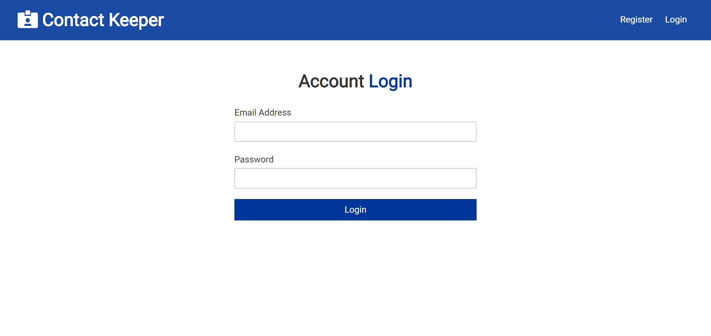
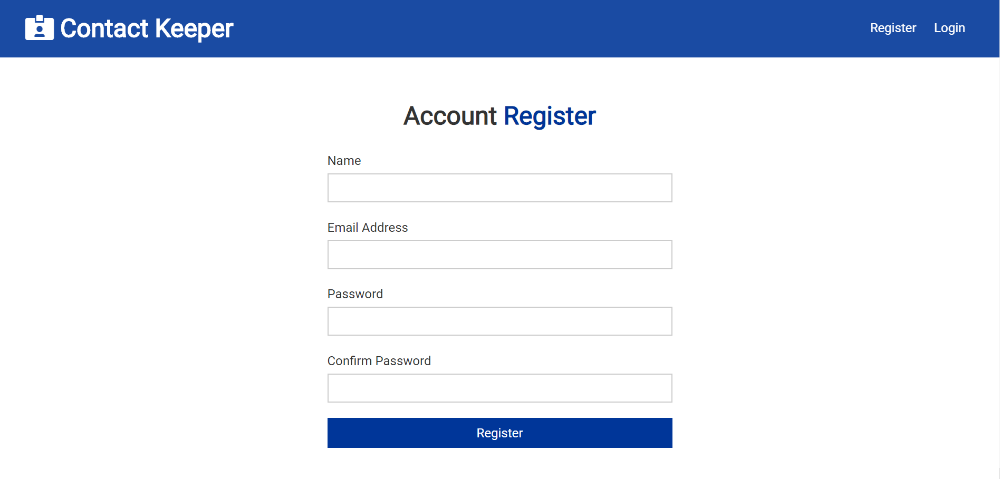
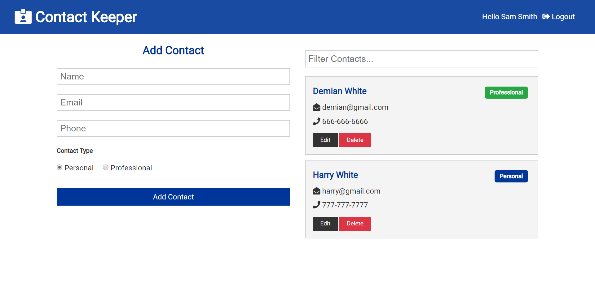
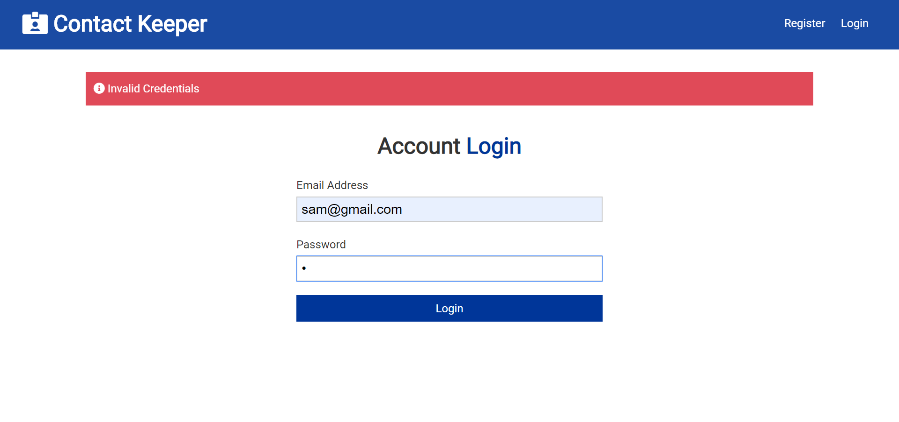
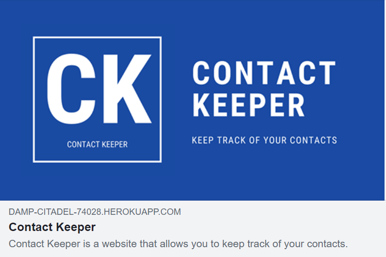

# Contact Keeper

# Project Description

Contact Keeper is a full-stack MERN application that allows a user to keep track of contacts. The user must register in order to create an account, after which, the user can log in to access his or her contacts. A contact's name, email address, and phone number can be saved, as well as whether the contact is a personal or a professional contact. There is also a filter function that allows the user to look for particular contacts by filtering by name. This application has complete CRUD functionality, since the user can also edit a contact's information, or delete the contact altogether.

A complete backend API was built in order to interact with React, along with the use of React hooks. JSON Web tokens are used for authentication, and there is also validation, so if a user tries to register an email that is already taken, the user will get an alert saying that the user already exists. Both user and contact information is stored in the MongoDB Atlas database. Other features include React Transition Group for fade animations, Font Awesome for the icons, a spinner GIF that is displayed when a page is loading, and the use of Open Graph meta tags to control how the application's URL is displayed when shared on social media. The favicon was created on Canva. Finally, a custom CSS file is used. Contact Keeper was deployed using Heroku. This application is part of the "React Front To Back" Udemy course.

# Technologies Used

* MongoDB
* Express
* React
* Node
* NPM packages: Axios, React Router, React Transition Group, bcryptjs, UUID, Express-Validator, and Mongoose
* CSS

# Contact Keeper Live Link

Please check out the live link for Contact Keeper here:

https://damp-citadel-74028.herokuapp.com/

# Screenshots

